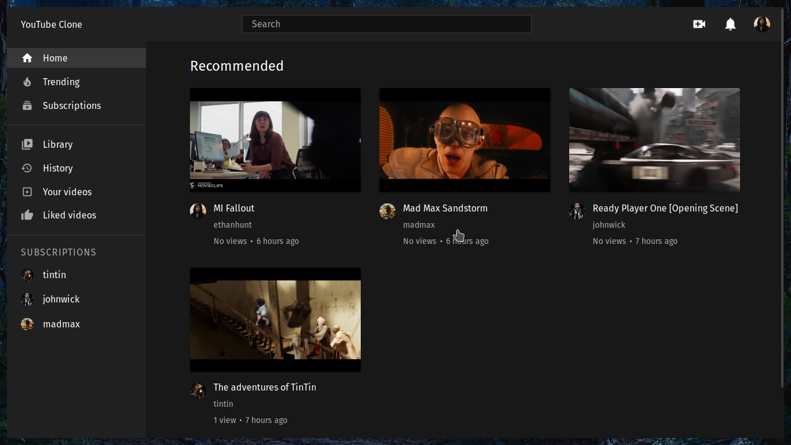
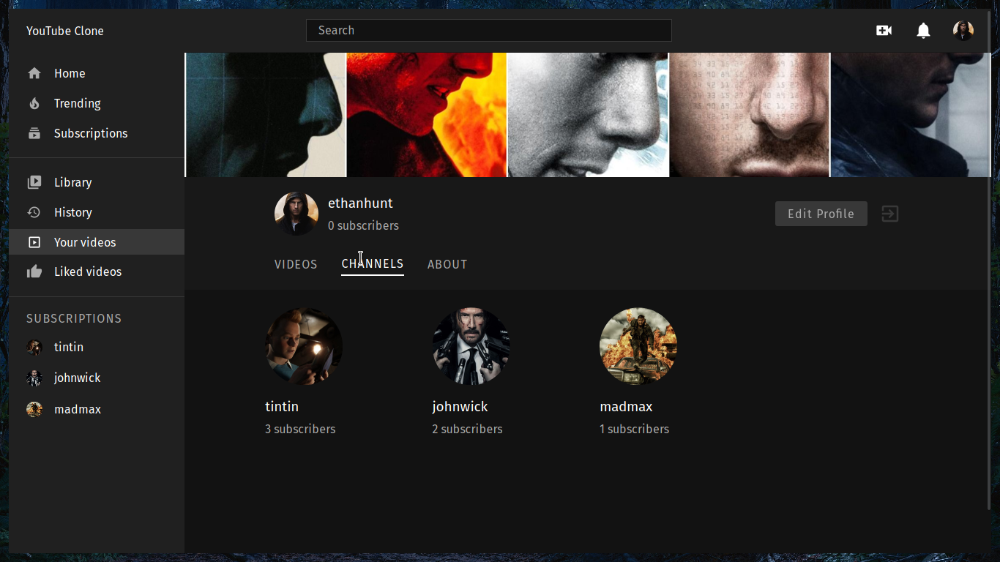
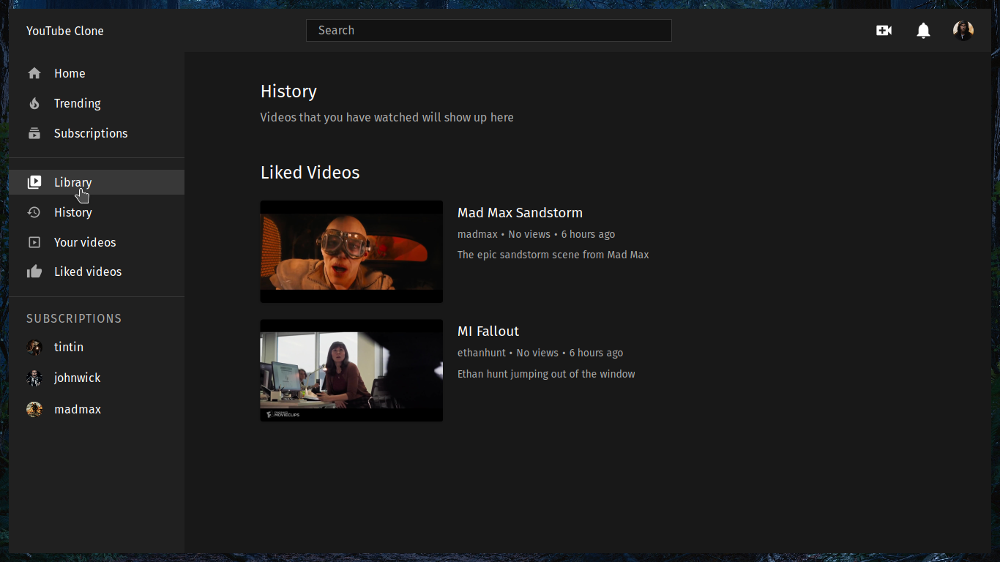
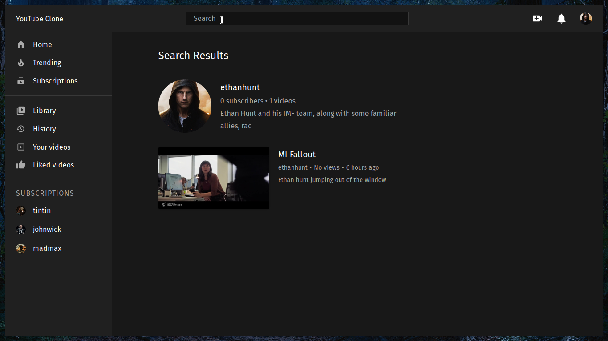

# Youtube Clone Backend

Youtube clone using PERN stack (Postgres, Express, React, Node). 

This is the backend repository, built with Express + Sequelize. If you are looking for the frontend repository, [click here](https://github.com/manikandanraji/youtubeclone-frontend)

Check out the [deployed site](https://utubeclone.netlify.app/)

## Core packages

1. sequelize - ORM for sql dialects
2. jsonwebtoken - authentication
3. bcryptjs - password hashing

## Features

1. Login/Signup
2. Upload video
3. Search video by channel name
4. Search video by title, description
5. Like/Dislike video
6. Subscribe/Unsubscribe from channels
7. Add comment
8. Edit profile (avatar, cover)
9. Liked videos
10. History

## Running locally

At the root of your project create an .env file with the following contents:

```javascript
JWT_SECRET=<YOUR_SECRET>
JWT_EXPIRE=30d // or any reasonable value that you prefer
DATABASE_URL=<YOUR_DB_CONNECTION_URI>
```

Then run <code>npm i</code> and <code>npm run dev</code> to start the development server

## Deploying to Heroku

Create your [heroku account](https://signup.heroku.com/) and install the heroku cli tool globally and login

```bash
npm i -g heroku
heroku login
```

Go to the root of this project, create an new heroku app and push it to the remote 'heroku'

```bash
heroku create
git push heroku master
```

Once the build finished successfully, you need to go to your heroku dashboard for this app and add the .env manually. If it
sounds confusing, refer this [guide](https://devcenter.heroku.com/articles/config-vars#using-the-heroku-dashboard)

### Heroku postgres addon

You can also use the heroku postgres addon and use that database for this clone

```bash
heroku addons:create heroku-postgresql:hobby-dev
```

Now you can use the DATABASE_URL connection string from heroku postgres and use that in your .env. To get your connection string use:

```bash
heroku config # if everything worked you will a connection string
```

## Watch the Demo

[](https://youtu.be/wHLurtOnmyM "Youtube Clone Demo")

## UI

### Home



### Trending


### Watch


### Suggestions


### Channel


### Edit Profile




### Library



### Search



## My Clone Trilogy

With this clone, I am finishing what I call 'my clone trilogy'. If you are interested, you can visit my other clones that are part of this trilogy

1. Twitter

   - [Frontend](https://github.com/manikandanraji/twitter-clone-frontend)
   - [Backend](https://github.com/manikandanraji/twitter-clone-frontend)

2. Instagram
   - [Frontend](https://github.com/manikandanraji/instaclone-frontend)
   - [Backend](https://github.com/manikandanraji/instaclone-backend)
